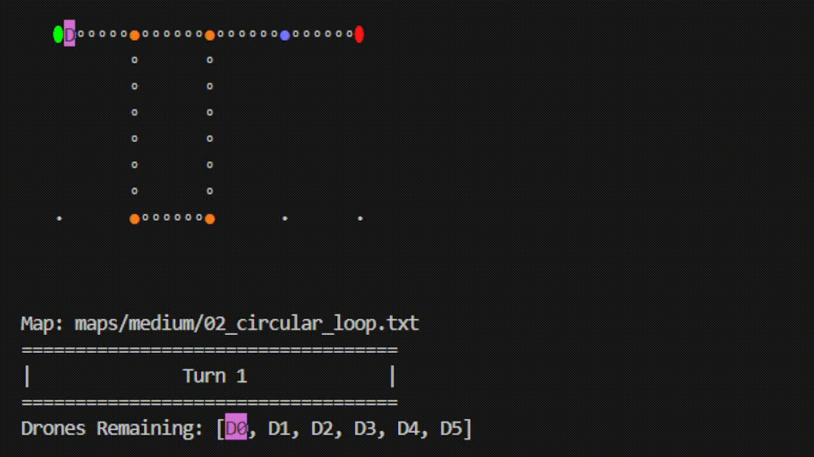

*This project has been created as part of the 42 curriculum by ryeong.*

# Project: Fly-in

## Description
This project is about drones pathfinding from start to end in a Node Graph Map under a set of rules as efficiently as possible.

### Rules
#### <ins>Movement Mechanics</ins>
- Every *Drone* has a chance to move per turn. Moving from one *Node* to another takes 1 turn.
- *Drones* moving out from a *Node* free up space on the same turn.
- *Drones* may choose to not move and wait for better movement opportunities
- *Drones* moving into *Nodes* with `restricted` zone type takes 2 turns instead
- *Drones* moving into *Nodes* with `restricted` zone type **MUST** reach the next *Node* within 2 turns and cannot wait on the *Connection*.
- *Drones* must respect capacity limits in *Nodes* and *Connections*

#### <ins>Nodes</ins>
- Must have exactly one Start and End *Nodes*
- Paths between Start and End *Nodes* must be valid
- Start and End *Nodes* are treated as having infinite capacity
- *Nodes* with `restricted` zone type must take 2 turns to complete
- *Nodes* with `priority` zone type should be preferred to travel to
- *Nodes* with `blocked` zone type is invalid to travel to

#### <ins>Connections</ins>
- *Connections* are bidirectional (*Drones* can move Node1->Node2 and Node2->Node1)

### Map file Format
#### <ins>Map file Syntax</ins>
**Comments:**

Lines starting with ’#’ are ignored

---

**Define number of Drones:**
```
nb_drones: <positive_number>
```

---

**Define Node:**

Valid fields:
- `start_hub`: Start Node.
- `end_hub`: End Node.
- `hub`: Regular Node.

Metadata fields and syntax (Optional):
- `zone`: determine *Node* type. (default: `normal`)

    ```
    zone=<type>
    ```
    Values: `normal`, `priority`, `restricted`, `blocked`

- `color`: determine colour of *Node* (default: `white`)

    ```
    color=<value>
    ```
    Values: `red`, `orange`, `yellow`, `lime`, `green`, `cyan`, `light_blue`, `blue`, `purple`, `magenta`, `pink`, `brown`, `gray`, `light_gray`, `black`, `white`, `maroon`, `gold`, `darkred`, `crimson`, `violet`, `rainbow`

- `max_drones`: determine *Node* capacity. (default: 1)
    ```
    max_drones=<positive_number>
    ```

Full Syntax:
```
<node_field>: <name> <x> <y> [metadata]
```

Example:
```
hub: junction 4 3 [zone=priority color=green max_drones=2]
```

---

**Define Connection:**
```
connection: <name1>-<name2> [metadata]
```

Metadata fields and syntax (Optional):
- `max_link_capacity`: determine *Connection* capacity. (default: 1)

    ```
    max_drones=<positive_number>
    ```

Example:
```
connection: corridorA-tunnelB [max_link_capacity=2]
```

#### <ins>Map file rules</ins>
- The first field must be `nb_drones`
- There must be exactly one `start_hub` and `end_hub` fields
- *Node* fields must have unique names and valid integer coordinates.
- *Node* names cannot have *dashes* and *spaces* in their names
- Must have unique *Connections* (e.g., a-b and b-a are considered duplicates).
- Capacity values (`max_drones` for *Nodes*, `max_link_capacity` for *Connections*) must be positive integers.
- The `max_drones` capacity is ignored on the `start_hub` and `end_hub` *Nodes*

Example:
```
nb_drones: 5

start_hub: hub 0 0 [color=green]
end_hub: goal 10 10 [color=yellow]
hub: roof1 3 4 [zone=restricted color=red]
hub: roof2 6 2 [zone=normal color=blue]
hub: corridorA 4 3 [zone=priority color=green max_drones=2]
hub: tunnelB 7 4 [zone=normal color=red]
hub: obstacleX 5 5 [zone=blocked color=gray]

connection: hub-roof1
connection: hub-corridorA
connection: roof1-roof2
connection: roof2-goal
connection: corridorA-tunnelB [max_link_capacity=2]
connection: tunnelB-goal
```

### Simulation Output Format
- Each *Drone* movement will have this format: `D<ID>-<node>`, or `D<ID>-<connection>` (for movement towards `restricted` *Nodes*)
- Each line represents one simulation turn
- *Drones* that do not move in a given turn are omitted from that line.
- *Drones* that reach the *End Node* are considered delivered and are no longer tracked.
- The simulation ends when all *Drones* have reached the End Node.

Example:
```
D1-roof1 D2-corridorA
D1-roof2 D2-tunnelB
D1-goal D2-goal
```

### Algorithm choices and Implementation Strategy
I chose *Dijkstra* for my pathfinding algorithm as it was the most common and simplest to implement algorithm for *Node* graph pathfinding.

From the start, I wanted to implement it in a way that allows it to dynamically recalculate the costs based on where the other drones are on the map so I made it so that the drones would call the *Dijkstra* algorithm each time they want to move. 

This is so that I don't have to have it travel along a pre-determined path and only recalculate the path once it realizes that the path is blocked. This way the drones and change to a better path (if possible) earlier if they think the current path ahead is getting too expensive from the other drones occupying it.


### Visual Representation features


#### <ins>Tile Size</ins>
You can change how many characters a *cell* occupies when rendering the map.

(default: 7)

#### <ins>Speed Modifier</ins>
You can change how fast to play the animation by the *Speed Modifier*.  Fastest speed caps out at your device performance

(default: 1.0)

#### <ins>HUD</ins>
Shows information about the current Map File Name, Turn Number, Drones List and which *Drones* are moving.

- Each *Drone* moves once in sequence starting from left to right (indicated by purple background).

- *Drones* that have red background are currently moving to a `restricted` *Node* and are in the middle of a *Connection*

- *Drones* that reach the *End Node* dissapear from the *HUD*

- Turn Number borders will flash yellow when moving to the next turn.

- Turn Number border scales with the map size


## Instructions
### Run Program:

Syntax:
```
./fly_in <map_file_path> [tile_size] [speed_modifier]
```
<...> - Required Parameter, [...] - Optional Paremeter


Examples:
```
./fly_in map.txt
```
With optional parameters
```
./fly_in map.txt 5 0.5
```

- `[tile_size]` must be positive integer

- `[speed_modifier]` must be positive number

### Auto run all provided map files in sequence
```
for x in maps/easy/*.txt maps/medium/*.txt maps/hard/*.txt maps/challenger/*.txt; do ./fly_in $x 7 10 && sleep 2; done  
```

## Resources
#### Readme
- Readme Syntax: https://docs.github.com/en/get-started/writing-on-github/getting-started-with-writing-and-formatting-on-github/basic-writing-and-formatting-syntax

- Resizing GIF: https://stackoverflow.com/questions/54032443/resizing-gif-in-markdown-github


#### General
- Colour List:
    - https://pinecone.academy/blog/minecraft-colors-the-ultimate-guide-to-dyeing-building-customizing
    - https://htmlcolorcodes.com/colors
- Algorithms:
    - https://en.wikipedia.org/wiki/Bresenham%27s_line_algorithm
    - https://www.geeksforgeeks.org/dsa/dijkstras-shortest-path-algorithm-greedy-algo-7/

### Declaration of AI Use
- Assist in general debugging and mypy/flake8 errors
- Implementing and optimizing algorithms (Bresenham's line algorithm *(for drawing connection lines)*, Dijkstra's algorithm, pathfinding costs, and bidirectional movement).
- Graphics and Animation (tile scaling and one-turn animation).
- Print HUD info list comprehension

